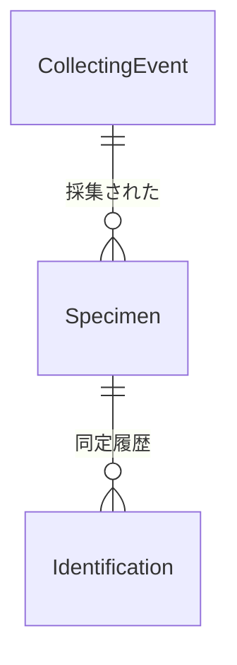

# 採集・標本データベース 運用・データ仕様書

版：設計案 1.6（2026-09-29）

## 1. 目的と前提

採集イベントを登録し、そのデータを使って標本のデータラベルを印刷する。ラベルを標本に付けた後、QR を読んで実際に存在する標本だけを登録する。同定は任意で、後日の再同定を履歴として残す。

既存の `CollectionRecord` と登録用 Lambda が稼働している。以下は今後の目標設計であり、現在のデータベースに適用済みという意味ではない。

## 2. データの関係



`Taxon` は同定名入力を助ける辞書で、`Identification` とは ID で関連付けない。和名・学名の文字列を同定時にコピーして保存する。

人が扱う `eventNumber` と `specimenNumber` は、データベースが内部で使う `id` とは別に持つ。標本は `collectingEventId` で採集イベントに、同定は `specimenId` で標本に紐づく。

## 3. テーブル／モデル案

### 3.1 CollectingEvent（採集イベント）

| 項目 | 型の目安 | 用途 |
| --- | --- | --- |
| `id` | ID | 内部識別子。標本から参照される |
| `eventNumber` | 整数 | 人が検索するイベント番号。新規登録時にサーバー側で発番 |
| `localityJapaneseFull` | 文字列 | 採集地の正式な日本語表記 |
| `localityJapaneseShort` | 文字列、任意 | ラベル向けの短い表記 |
| `localityRomaji` | 文字列、任意 | ローマ字表記 |
| `latitude` / `longitude` | 数値、任意 | 緯度・経度 |
| `altitude` | 数値、任意 | 標高 |
| `date` | 日付 | 採集日 |
| `collector` | 文字列 | 採集者（綴りは `collector`） |
| `method` | 文字列、任意 | 採集方法 |
| `memo` | 文字列、任意 | 採集イベントのメモ |

必須／任意の細部は、現行の登録フォームとデータ移行を確認して確定する。過去の `CollectionRecord.recordNumber` は `eventNumber` に相当する。

### 3.2 Specimen（実在標本）

| 項目 | 型の目安 | 用途 |
| --- | --- | --- |
| `id` | ID | 標本の内部識別子 |
| `specimenNumber` | 整数 | 標本固有の番号。ラベル印刷時に発番し、登録時に引き継ぐ |
| `collectingEventId` | ID | 対応する `CollectingEvent.id` |
| `sex` | 選択値／文字列、任意 | 性別・不明・未判定を扱う |
| `memo` | 文字列、任意 | 標本自体のメモ |

`Specimen` のレコードは印刷時には作らず、ラベルの QR を読んで登録を確定したときに作成する。未使用・切断に失敗したラベルは欠番となる。和名・学名は標本本体の項目にせず、同定履歴に持たせる。

### 3.3 Identification（同定履歴）

| 項目 | 型の目安 | 用途 |
| --- | --- | --- |
| `id` | ID | 同定の内部識別子 |
| `specimenId` | ID | 対応する `Specimen.id` |
| `identifiedAt` | 日付、任意 | 同定日 |
| `identifiedBy` | 文字列、任意 | 同定者 |
| `japaneseName` | 文字列、任意 | その同定時に使った和名 |
| `scientificName` | 文字列、任意 | その同定時に使った学名 |
| `memo` | 文字列、任意 | 同定根拠や訂正理由 |

未同定の標本は `Identification` が 0 件。同定・再同定のたびに新しい行を追加し、以前の行を上書きしない。同定を作成するときは和名または学名の少なくとも一方を入力する。現在採用する同定の決め方は未確定（第 8 節）。

### 3.4 Taxon（名前辞書）

| 項目 | 型の目安 | 用途 |
| --- | --- | --- |
| `id` | ID | 辞書項目の識別子 |
| `japaneseName` | 文字列、任意 | 和名 |
| `scientificName` | 文字列 | 学名 |
| `orderJapaneseName` / `orderScientificName` | 文字列、任意 | 目 |
| `familyJapaneseName` / `familyScientificName` | 文字列、任意 | 科 |
| `subfamilyJapaneseName` / `subfamilyScientificName` | 文字列、任意 | 亜科 |
| `genusScientificName` | 文字列、任意 | 属 |
| `descriptionYear` | 整数、任意 | 記載年。辞書の更新年や同定年とは異なる |
| `sortOrder` | 数値／順序キー | 分類表などでの表示順。`id` とは分離 |

種の追加や並べ替えでは `sortOrder` を変更し、`id` は再利用・付け替えしない。和名から学名を補完する用途を想定する。辞書の名前を後日訂正しても、同定時に `Identification` に書き込んだ名前は変わらない。同名・異名・分類体系の版管理は将来の拡張事項。

### 3.5 発番カウンター

採集イベント用と標本用の独立したカウンターを AWS 側に持つ。複数端末から同時に操作しても同じ値を配らないよう、原子的に増加させる。`eventNumber` はイベント登録時、`specimenNumber` はラベル印刷用の番号確保時に発行する。採番後に使用しなかった番号の欠番は許容する。

## 4. 業務手順

### A. 採集イベント登録

1. 採集地・日付・採集者・方法などを入力する。
2. AWS 側で `eventNumber` を 1 件発番し、`CollectingEvent` に保存する。
3. イベント番号と内容を確認する。

### B. データラベル印刷

1. `eventNumber` で採集イベントを選び、内容を確認する。
2. 必要枚数を入力する。切断失敗に備えて実際の標本数より多く指定できる。
3. AWS 側でその枚数分の `specimenNumber` を確保し、各ラベルに割り当てる。この時点では `Specimen` を作成しない。
4. React で採集地・採集日などの印刷情報と、イベント番号＋標本番号を表す QR を Excel のデータラベル用テンプレートに書き込み、印刷用ファイルを作る。
5. 印刷に失敗した番号や使わなかった番号は欠番とする。再印刷では、可能なら元の番号・印刷データを再利用する。

QR の正式形式は未決定。小さい QR を優先するため、従来の暫定案 `CE:00000002;SP:00000103` を見直し、数字のみの固定幅を第一候補とする。例えばイベント番号 8 桁＋標本番号 8 桁なら `0000000200000103`（16 桁）で、先頭 8 桁＝イベント番号 2、後半 8 桁＝標本番号 103 と一意に分解できる。6 桁＋8 桁なら `00000200000103`（14 桁）になるが、イベント番号の上限と将来の拡張を考えて桁数を決定する。読取側では長さ・数字のみ・各番号の範囲を検証し、形式変更時には旧ラベルも読めるようにする。ゼロ埋めは QR の文字列表現であり、DB の番号は整数とする。イベント番号と標本番号の両方を含めるのは、初回読取時には `Specimen` が存在しないため。

数字だけにすれば QR の数字モードを利用できる。一方、桁を少し減らしても同じ QR バージョン内ならマス目の数は減らない。実際の印刷サイズは誤り訂正レベル、余白、プリンタ解像度、スマホでの読取結果を用いて決定する。

### C. 標本登録・初回同定

この画面は、ラベルを付けた標本を扱いながらスマートフォンで使用する想定。

1. 物理標本にデータラベルを付ける。
2. 登録画面で QR を読み、`eventNumber` と `specimenNumber` を取り出す。
3. 該当イベントを取得し、採集地・日付などを表示して確認する。
4. 標本の性別やメモを入力する。和名入力では音声認識を利用でき、認識結果を画面上で確認・修正してから登録する。和名は任意で、必要なら `Taxon` を引いて学名を補完する。和名のない種は学名を入力できる。
5. 登録確定時に `Specimen` を 1 件保存する。和名または学名が入力されていれば `Identification` も 1 件追加する。両方空欄なら未同定として標本だけを登録する。
6. 同じ QR が再度読まれた場合は、既存標本を表示し、同じ番号の新規登録を拒否する。

### D. 再同定

1. 標本番号または QR から `Specimen` を表示する。
2. 以前の同定履歴を確認する。
3. 新しい `Identification` を追加する。古い同定行は保持する。

### E. 登録済みデータの閲覧・出力（今後検討）

登録した採集イベント・標本・同定履歴を、番号、日付、採集地、和名・学名などで検索・閲覧する画面を今後検討する。CSV・Excel などへの出力範囲や書式も今後決める。同定履歴を出力する際には「全履歴」と「現在採用する同定」を区別する必要がある。現時点では形式・画面・実装方法を確定していない。

## 5. フロントエンドと印刷ファイルの方針

- 標本登録画面：スマートフォンの縦画面を基本とし、カメラでの QR 読取、採集イベントの確認、和名・性別などの入力、登録完了までを無理なく操作できる配置にする。読取失敗時には番号の手入力も可能にする。QR 読取中のカメラ映像は画面上で左右反転して表示する。
- 登録時の誤操作防止：QR を読み取っただけでは保存せず、イベント番号・標本番号・採集情報を表示して登録操作で確定する。二重読取・通信中の連打・登録失敗を画面上で判別できるようにする。
- データラベル印刷：あらかじめ用意した Excel テンプレートの指定セル／領域へ、React アプリで値と QR を配置し、印刷用ファイルとしてダウンロードする想定。テンプレートは印刷位置を合わせて作る。QR の画像をセルにどう固定・配置するか、使用するライブラリと印刷精度は試作で確認する。
- 和名の音声入力：標本登録画面の音声入力ボタンで認識した文字列を和名欄に反映する。認識中の表示と手修正を可能にする。認識結果を自動確定・自動保存せず、利用者が内容を確認して登録する。
- データの出力：印刷用 Excel と、登録済みデータの一覧・集計用 CSV／Excel は目的が異なるため、出力仕様をそれぞれ定める。

## 6. 必要なデータ整合性

- 番号の一意性：両番号はそれぞれの系列で一意。番号を発行する機能へのアクセスを制限し、登録時にもサーバー側で衝突を拒否する。単に `id` を別に持つだけ、または画面で既存検索するだけでは番号重複は防げない。
- 印刷済み番号の検証：QR の `specimenNumber` が確かに当該 `eventNumber` 向けに発行されたかまで保証するには、番号・イベント ID・印刷単位を記録する発行台帳が必要。台帳なしの最小構成では、番号形式と未登録チェックはできるが、別イベント向けの発行だったかは証明できない。
- 重複 QR：同じデータのラベルが物理的に二枚ある場合、両方を別標本として登録してはいけない。重複登録を拒否して現物確認を促す。
- 入力の一体性：標本保存と初回同定保存の途中失敗時にどう復旧・再試行するかを決める。少なくとも再試行で標本を二重作成しない。
- `collectingEventId` と `specimenId` には内部 ID を保存し、人向け番号を参照先 ID の代用にしない。

## 7. 現行アプリからの移行範囲

現行 `CollectionRecord` を `CollectingEvent` に移す場合、既存レコードと番号の保持、`amplify/data/resource.ts`、採集イベント登録用 Lambda／カウンター、`src/api/records.ts`、React の入力・検索・表示・QR 処理を点検する。単純にモデル名を変えてデプロイしても既存データの移行は完了しない。新しい `Specimen`・`Identification`・`Taxon` と標本用発番・印刷機能を段階的に追加する。

## 8. 実装前に決める事項

| 論点 | 現在の状態・候補 |
| --- | --- |
| 標本番号の表示 | 整数を保存し、ラベルでは `AIC00001` 等の接頭辞・桁数を検討 |
| QR の正式書式 | 数字のみの固定幅が第一候補。イベント番号・標本番号の桁数、上限、旧形式との互換性を確定。16 桁と 14 桁の印刷・読み取りを比較 |
| 番号発行台帳 | 発行番号とイベントの対応、印刷単位、再印刷履歴を管理するか。厳密な照合には必要 |
| 印刷途中の失敗 | 確保済み番号を再印刷するか、欠番として再発行するか |
| Excel テンプレート | ラベルの用紙・セル配置、QR 画像の埋め込み位置、印刷精度を試作で確認 |
| スマホでの登録 | 実機での QR 読取、カメラ権限、画面幅、音声入力、通信切断時の再試行を確認 |
| 音声入力 | 使用端末での対応と認識結果の確認・修正手順を確認 |
| 現在の同定 | 最新の追加を採用するか、明示的な採用フラグ／ID を管理するか |
| 閲覧・出力 | 検索条件、一覧項目、CSV／Excel 形式、履歴の扱いを決める |
| 未同定・性別 | 性別の選択肢と、和名・学名の入力検証を確定 |
| 権限 | 誰が各種の登録、発番、訂正、閲覧をできるか |
| 既存データ | 現行 `CollectionRecord` の項目対応、番号・ID の維持と移行方法 |

本書中の型・項目の必須設定・登録 API は設計上の目安であり、実際の Amplify 定義と既存データに合わせて実装時に確定する。

## 9. 現行 `src` コードの確認と改良計画

確認対象は、2026-09-29 に共有された `src(1).zip` の内容。`amplify/data/resource.ts`、Lambda、Excel テンプレート、`package.json` はこの ZIP に含まれないため、バックエンドの実際の制約やテンプレート互換性は未確認。以下は**実装済みの報告ではなく、現行コードから特定できた変更予定**である。

### 9.1 現在できていること／まだないこと

| 現行コード | 状態と仕様との対応 |
| --- | --- |
| `src/App.tsx` + `src/api/records.ts` | 採集イベント相当の `CollectionRecord` を登録・一覧・検索・削除できる。登録 API は `registerCollectionRecord`、採集番号は `recordNumber` |
| `src/Touroku.tsx` | QR の読み取り文字列を `searchNumber` に入れ、イベント番号で検索し、和名の入力と音声入力・認識中表示ができる |
| `src/components/QrScanner.tsx` | カメラ QR 読取を共通コンポーネントにしている |
| `src/ModeRouter.tsx` | 標本登録に `Touroku` を割り当てた。再同定・データラベル印刷・同定ラベル印刷は案内表示のみ |
| `Specimen` / `Identification` / `Taxon` の操作 | 添付の `src` には登録・検索 API や対応する型・画面がまだない。バックエンドにモデルがあるかは未確認 |

### 9.2 型と API の変更

1. `src/types.ts` の `CollectionRecord.id: number` は実際には `recordNumber`、`cloudId: string` はモデルの `id` を表している。移行時は `CollectingEvent` 型を `id: string` と `eventNumber: number` に整理し、`location`→`localityJapaneseFull`、`locationLabel`→`localityJapaneseShort`、`collectingMethod`→`method` などを対応付ける。現行画面だけを先に改名しない。
2. `Specimen`、`Identification`、`Taxon`、QR の読取結果をそれぞれ別の型にする。作成時の入力型には自動生成の `id` や番号を含めず、返却結果型と区別する。`Specimen` に同定名を重複して置かず、未同定でも作成できるようにする。
3. `src/api/records.ts` の `getCollectionRecordByNumber` は `list` のページをたどって番号一致を探している。データ量が増える前に番号検索用のアクセス方法／索引を検討し、返却 0 件と複数件を区別する。複数件は番号重複として扱う。`loadCollectionRecords` も全ページを一度に取得するため、一覧画面にはページ分け・検索条件を設ける。
4. API の責務を採集イベント検索・登録、ラベル番号確保、標本登録／取得、同定履歴追加、名前辞書検索に分ける。ファイル分割例は `src/api/collectingEvents.ts`、`specimens.ts`、`identifications.ts`、`taxa.ts`。AWS 側の発番・登録処理と合わせて整備する。
5. `removeCollectionRecord` は現状 `cloudId` だけで削除できる。標本が紐づいた採集イベントを削除すると参照が失われるため、関連標本の存在確認・削除禁止などのルールをバックエンドでも設ける。画面の非表示だけに依存しない。

### 9.3 QR・スマホ画面・音声入力

1. `Touroku.handleScan` は読取文字列全体を `searchNumber` に入れ、`handleSearch` は `Number(searchNumber)` をイベント番号とみなしている。２番号入り QR に変更する際は、**最初から文字列として**長さ・数字・範囲を検証し、イベント番号と標本番号に分割する。QR 全体を JavaScript の `Number` に変換しない（16 桁には安全な整数の範囲を超える値があり得る）。検索成功後はイベントの内部 ID を保持する。
2. QR 読取は一度成功したら連続通知による二重検索・二重登録を避ける。読み取った番号と検索結果を表示してから登録し、`isSearching`、`isSaving`、エラー、未検索／見つからない状態を分ける。別の QR 読取・番号編集時は以前の `foundRecord` をクリアし、前のイベントを誤登録しない。
3. `QrScanner` は `id="qr-reader"` が固定で、同じ画面で複数配置する用途には不向き。将来複数のスキャナーを設ける場合は ID を引数化する。**QR 読取画面のカメラ映像はスマホでも左右反転表示する**。現行 `index.css` の `#qr-reader video { transform: scaleX(-1) }` を反転設定として維持し、映像の見た目だけを変えて読み取った文字列は反転しない。スマホ実機で背面カメラ・読取範囲・読み取りやすさを確認する。
4. `Touroku.startVoiceInput` はコンポーネント内にあり `any` でブラウザ API を扱う。別画面でも利用する段階で `src/utils/voiceInput.ts` 等へ移し、型定義・未対応・権限拒否・認識失敗・終了時の状態解除を整える。音声結果は `Taxon` 候補検索や手修正の後、登録ボタンで確定する。
5. `Touroku` は現状、検索したイベントと和名の**表示まで**で、標本番号表示、性別・メモ、標本作成、初回同定追加、登録結果表示がない。仕様第 4 節 C に沿って追加する。QR が読み取れないときの番号入力でも両番号を扱えるようにする。

### 9.4 採集画面・モード・表示

1. `src/App.tsx` の既存登録フォームにはラベル用地名 (`placeNameForLabel`) があり、`localityJapaneseShort` に対応できる。一方 `memo` は未入力。`CollectingEvent` 移行時に採集メモ欄を追加する。
2. `src/App.tsx` の地点選択 `selectPosition` は通信完了後に入力値を更新する。次の地点を先に選んだ場合、古い地点の API 応答が後から到着して上書きしないよう、要求の世代管理や中止処理を検討する。
3. `src/ModeRouter.tsx` の印刷・同定モードは未実装。データラベル印刷ではテンプレートの取得・番号確保・Excel への値と QR の配置・ダウンロードを追加し、同定モードでは既存標本の検索・履歴表示・新しい同定の追加を行う。
4. `RecordCard` の「採集ID」は現在、人向けの `recordNumber` を表示しているため、移行時には「採集イベント番号」と明記する。React の一覧キーも内部の `id` を使うと両者の役割が明確になる。
5. `src/index.css` の `#root` は広い固定最大幅、`src/App.css` にも `#root` の余白がある。標本登録画面をスマホ実機で確認し、画面幅・余白・タップ領域・カメラ映像・ソフトキーボード表示を調整する。
6. `src/App.tsx` の `<h1　className="app-title">` は `h1` と `className` の間が全角空白に見える。実際のビルドで属性が意図どおり解釈されるか確認し、通常の半角空白に直す。

### 9.5 実装順の提案

1. QR の桁数・構文、発番時のイベント対応を確定し、発行台帳が必要か決める。
2. バックエンドの現状と既存データを確認して `CollectionRecord`→`CollectingEvent` の移行方法を決める。番号と内部 ID の対応を保つ。
3. `Specimen` モデルと標本番号確保・重複防止・登録処理を用意し、QR の解析とスマホ登録画面を完成する。
4. `Identification` と `Taxon` を追加して、任意の初回同定、音声入力補助、履歴を残す再同定を実装する。
5. Excel テンプレートの実物でラベル印刷を試作し、スマホで読める大きさ・配置・再印刷を検証する。閲覧・出力を整備する。

## 10. 開発環境・GitHub・デプロイ手順

### 10.1 既知の環境

| 項目 | 内容 |
| --- | --- |
| ローカルプロジェクト | `C:\Users\matsu\Desktop\amplify-vite-react-template`（ユーザーの Windows PC 上） |
| GitHub | `https://github.com/matsufreq-64/amplify-vite-react-template` |
| デプロイ対象 | GitHub の `main` ブランチに連携した AWS Amplify アプリ |
| 公開 URL | `https://main.dvccoi0l3zrp8.amplifyapp.com`（以前共有された URL。実際の確認前に Amplify コンソールで現在の URL を照合） |
| フロントエンド | React + TypeScript + Vite |
| バックエンド | AWS Amplify Gen 2。`amplify/data/resource.ts` 等で定義 |

この仕様書の第 9 節は `src(1).zip` を確認した時点のコードに基づく。実装着手時には作業対象のリポジトリ、現行のバックエンド定義、`package.json`、ロックファイル、デプロイ設定、Excel テンプレートと Git の状態を再確認する。公開 URL や AWS の認証情報はコードや仕様書に秘密情報として書き込まない。上記 URL はアクセス先であり、認証情報ではない。

### 10.2 作業前のバックアップと変更手順

1. 現在動いているプロジェクトをプロジェクト外の別フォルダへ丸ごとコピーし、`src` と `amplify` が含まれることを確認する。バックアップ側では開発しない。
2. 元のプロジェクトで `git status` を確認する。既存の未コミット変更を消さない。移行を伴う変更の前に、必要なら現在の状態をコミットしておく。
3. Codex には本仕様書、プロジェクト一式（少なくとも `src`、`amplify`、`package.json`、`package-lock.json`、`vite.config.ts`、デプロイ設定）、既存データの扱いを示して作業させる。`node_modules`、`dist`、`.git` は共有 ZIP に不要。作業対象が GitHub の作業ツリーかアップロード ZIP かを明確にする。
4. テーブル名の変更は単純なリネームとして扱わず、移行先モデル、既存レコード、番号、参照 ID、Lambda、画面を段階的に整合させる。バックエンド変更前にデータのバックアップ・復元方法を確認する。

### 10.3 ローカル確認から公開まで

ユーザーの PowerShell での例（`main` に push する前に差分と状態を確認する）。

```powershell
cd C:\Users\matsu\Desktop\amplify-vite-react-template
git status
npm ci
npm run build
npm run dev
```

`npm run build` はビルド確認であり、それ自体で画面の操作確認は完了しない。`npm run dev` で起動したローカル画面でも、QR、標本登録、未同定、再同定、印刷の変更箇所を確認する。

```powershell
git diff
git add .
git status
git commit -m "Implement specimen registration workflow"
git push origin main
```

`git add .` の前に秘密情報、生成物、印刷用の一時ファイルが混入していないか確認する。複数人で作業する場合や変更が大きい場合は、別ブランチでコミットし、レビュー後に `main` へ反映する。ブランチ運用は着手時に決定する。

このプロジェクトでは、GitHub の連携ブランチへの push を契機に Amplify のビルド・デプロイが始まる。Amplify コンソールで該当コミットのデプロイ成功を確認してから、公開 URL をスマートフォンでも開き、ログイン、カメラ権限、QR 読取、データの読み書きを確認する。`git commit` だけでは GitHub には送られず、`git push` が必要。バックエンドのスキーマ更新時は、フロントエンドのビルド成功と実際のデプロイ・既存データの動作確認を別々に行う。
